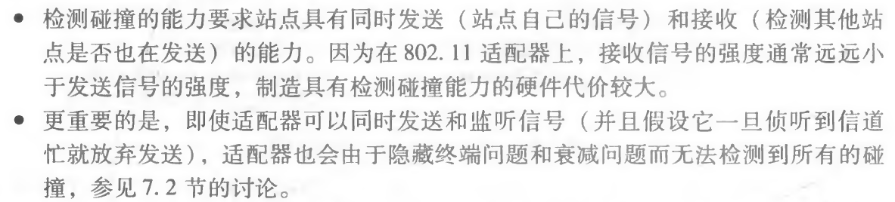
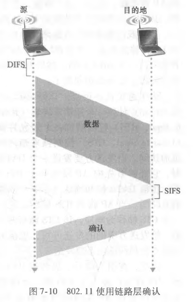
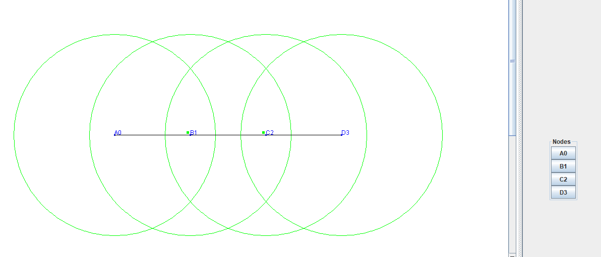
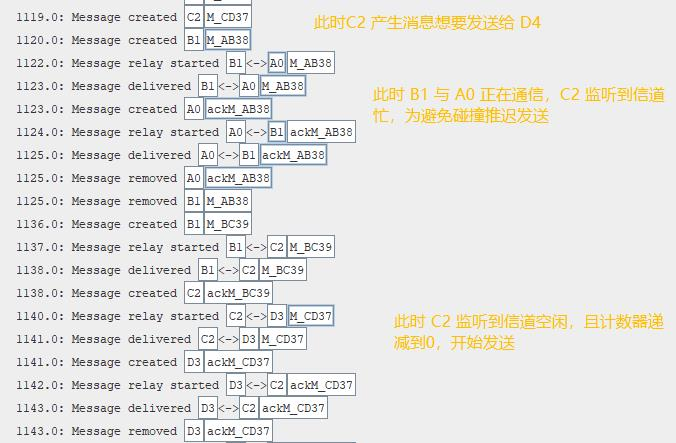

<!-- @import "[TOC]" {cmd="toc" depthFrom=1 depthTo=6 orderedList=false} -->

<!-- code_chunk_output -->

- [CSMA/CA](#csmaca)
    - [协议细节](#协议细节)
      - [参考文献](#参考文献)
  - [网络场景](#网络场景)
  - [代码实现](#代码实现)
      - [**Message:**](#message)
      - [**CARouter：** 有限状态机](#carouter-有限状态机)
      - [**update()** 方法：](#update-方法)
      - [**sendDeliverableMessages() 与 tryFirstMessageForConnected(List\<Tuple\<Message, Connection\>\> tuples)** 方法：](#senddeliverablemessages-与-tryfirstmessageforconnectedlisttuplemessage-connection-tuples-方法)
      - [messageTransferred(String id, DTNHost from) 方法：](#messagetransferredstring-id-dtnhost-from-方法)
    - [实现效果](#实现效果)

<!-- /code_chunk_output -->


# CSMA/CA

**背景：** 无线设备或者 AP 希望共享多个接入信道同时传输数据帧，因此需要一个多路访问协议来协调传输。CSMA/CA 是 802.11 的设计者为 802.11 无线 LAN 选择的随机访问协议。

与以太网的 CSMA/CD 相似：
   - “CSMA”代表“载波侦听多路访问”，每个站点在传输之前侦听信道，并且一旦侦听到该信道忙则抑制传输。

同时又有很大的区别:
1. 首先，802.11 使用碰撞避免而非碰撞检测。一旦站点开始发送一个帧，它将完全地发送该帧，即使碰撞存在。为了降级碰撞的可能性，802.11 采用了几种碰撞避免技术。
   - 不使用碰撞检测的原因：
  
2. 其次，由于无线信道相对较高的误比特率，802.11（不同于以太网）使用链路层确认/重传（ARQ）方案。

### 协议细节

我们将在下面讨论 802.11 的碰撞避免和链路层确认机制。


<html>
    <style>
        .box{
            width:100%;
            margin:0 auto;
            overflow:hidden;
        }
        .box .left{
            width:68%;
            float:left;
        }
        .box .right{
            width:30%;
            float:right;
        }
    </style>     
    <div class="box">
        <div class="left">
            <p>首先分析 802.11 的<b>链路层确认</b></p>
            <p>如图7・10所示，目的站点收到一个通过CRC校验的帧后，它等待一个被称作短帧间间隔（Short Inter-Frame Spacing, SIFS）的一小段时间，然后发回一个确认帧。如果发送站点在给定的时间内未收到确认帧，它假定出现了错误并重传该帧，使用 CSMA/CA 协议访问该信道。如果在若干次重传后仍未收到确认，发送站点将放弃发送 并丢弃该帧。</p>
        </div>
        <div class="right">
            
        </div>
    </div>    
</html>

了解了链路层确认机制后，可以描述 **CSMA/CA 协议流程：**

1. 如果某站点最初监听到信道空闲，它将在一个被称作分布式帧间间隔（Distributed Inter-Frame Space, DIFS）的短时间段后发送该帧，如图7・10所示
2. 否则，该站点选取一个随机回退值并且在侦听信道空闲时递减该值。当侦听到信道忙时，计数值保持不变。
3. 当计数值减为0时（注意到这只可能发生在信道被侦听为空闲时），该站点发送整个数据帧并等待确认。
4. 如果收到确认，发送站点知道它的帧已被目的站正确接收了。如果该站点要发送另一帧，它将从第二步开始 CSMA/CA 协议。如果未收到确认，发送站点将重新进入第二步中的回退阶段，并从一个更大的范围内选取随机值。

#### 参考文献
<div class="csl-bib-body">
  <div data-csl-entry-id="2018计算机网络" class="csl-entry"><i>计算机网络: 自顶向下方法</i>. (2018). 机械工业出版社. </div>
</div>


## 网络场景
四个Group， 每个Group有一个Host，每个Host具备一个SimpleBroadcastInterface。


## 代码实现

主体思路：我们编写了一个继承 ActiveRouter 的子类 CARouter，并在其 updata() 方法中模拟 CSMA/CA 协议的流程。

- CARouter 之外的代码修改：
#### **Message:**
增加一个标志位，用于区分是否是确认帧；
增加一个计数器，记录消息重传次数；
并为以上变量添加 getter() 和 setter() 方法，代码省略；
```java
	public static enum FLAGS { REQUEST, ACK};
	private FLAGS flag;  // 标志位
	private int timeOfSend = 0;   // 重传次数
```

- 新增的 CARouter
#### **CARouter：** 有限状态机
  - 属性
  比较关键的是 states {INIT, REGRESS, WAIT_ACK} 状态码，用来在 update() 方法中判断CARouter运行状态并进行相应的操作。
    - REGRESS 状态下监听信道，信道空闲且counter = 0时发送消息。
    - WAIT_ACK 状态下等待接收ACK消息。 
  
    counter 是计数器，信道空闲时递减，碰撞时二进制随机回退。
    crashTime 记录碰撞次数。
    curMsg 记录发送的消息，每次发送会更新它
    lastSendCon 记录上一次发送消息的连接，每次发送也会更新它
```java
    private static enum states {INIT, REGRESS, WAIT_ACK}    // 状态码
    private static final int SIFS = 1;  // 短帧间间隔
    private static final int DIFS = 5;  // 分布式帧间间隔
    private static final int BUSY = MessageRouter.TRY_LATER_BUSY;
    private static final int ORGINAL = 100;
    private static final int OK = 0;
    private static Random r = new Random();   // 随机数
    private int counter = DIFS;    // 计数值
    private int crashTime = 1;  // 碰撞次数
    private Message curMsg = null;      // 记录发送的消息
    private Connection lastSendCon = null;  // 记录上一次发送消息的连接
    private int waitTime = 0;   // 等待ACK时间
```
  - 方法
#### **update()** 方法：

CAMS/CA 的流程模拟基本都在这个函数里，大致分为两个阶段：
    1. 处理完成传输的消息，进行状态转移；
    2. 根据状态码运行

下面将逐行解释代码。

- 为了更方便的实现 CSMA/CA 的逻辑，这里没有调用父类的 update() 方法。
```java
@Override
public void update() {
    // super.update();
```

下面一段代码的效果是**处理 lastSendCon 上传输完成的 Message，进行状态转移**，也就是第一个阶段。

```java
    Connection con = lastSendCon;
    boolean removeCurrent = false;
    /* finalize ready transfers */
    if (con != null) {
```
  - 当lastSendCon 上的消息传输完成

```java
        if (con.isMessageTransferred()) {
            if (con.getMessage() != null) {
                Message m =con.getMessage();
                con.finalizeTransfer(); // 完成这次传输
```
  - 如果传输完成的是发给自己的ACK并且当前的状态是WAIT_ACK，则状态转移到 REGRESS 状态。

```java
                if(m.isACK() && m.getTo() == getHost()&& state == states.WAIT_ACK){
                    waitTime = 0;
                    state = states.REGRESS;
                }
```
  - 如果传输完成的是自己发送的非ACK消息，则状态转移到 WAIT_ACK。
  
```java
                else if(m.getFrom() == getHost() && !m.isACK()){
                    state = states.WAIT_ACK;
                }
            } 
            removeCurrent = true;
        }
        /* remove connections that have gone down */
        else if (!con.isUp()) {
            if (con.getMessage() != null) {
                transferAborted(con);
                con.abortTransfer();
            }
            removeCurrent = true;
        }
    }
if (removeCurrent) {
    // if the message being sent was holding excess buffer, free it
    if (this.getFreeBufferSize() < 0) {
        this.makeRoomForMessage(0);
    }
    sendingConnections.remove(con);
}
```

第二个阶段： **CSMA/CA 状态机**

```java
switch (state) {
```
  - INIT 状态：如果缓冲区有消息发送，并且目前有连接，状态转移到 REGRESS 监听信道，计数器设置为 DIFS。

```java
    case INIT: {
        if (canStartTransfer()) {    // 缓冲区有消息发送，并且目前有连接
            state = states.REGRESS;
            counter = DIFS;
            return;
        }
        break;
    }
```
  - REGRESS 状态：
    - 如果监听到链路忙，保持计数器不变返回。
    - 否则，如果计数器为零，则尝试发送message缓存区中最早的一条消息
        - 如果发送失败（retval == BUSY），说明发生了碰撞，则crashTime + 1，counter进行二进制指数后退。
        - （retval == BUSY）说明当前没有消息要发送，counter = DIFS。
    - 如果计数器不为零，则计数器递减。
  
```java
    case REGRESS: {
        if (isTransferring()) {   // 监听到链路忙（目前在传输或者邻居在传输）
            return;
        } else {   // 信道空闲
            if (counter == 0) {   // 当计数器为零时
                // 发送最早的整个数据帧并等待确认
                int retval = sendDeliverableMessages();
                if (retval == OK) {
                } else if (retval == ORGINAL) {
                    counter = DIFS;
                } else if (retval == BUSY) {
                    crashTime++;
                    counter = binaryExpRegress(crashTime); // 二进制指数后退
                }
            } else
                counter--;  // 计数器递减
        }

        break;
    }
```
  - WAIT_ACK状态：
  等待接收ACK，每次waitTime + 1。如果 waitTime 大于设定值（这里是50），则进行重传：将 curMsg 重新加入到 messages 缓存区，并setReceiveTime(0)，保证下一次最先发送。重传次数 大于设定值（这里是3）的消息直接从 messages 缓存区删除。

```java
    case WAIT_ACK: {
        waitTime++;
        if(waitTime > 50){
            if(curMsg != null){
                curMsg.setTimeOfReSend(curMsg.getTimeOfSend()+1);
                curMsg.setReceiveTime(0);
                addToMessages(curMsg, false);
                if(curMsg.getTimeOfSend() > 3){
                    removeFromMessages(curMsg.getId());
                }
            }
            state = states.REGRESS;
            waitTime = 0;
        }
        break;
    }
    default:
        throw new IllegalStateException("Unexpected value: " + state);
}
```

#### **sendDeliverableMessages() 与 tryFirstMessageForConnected(List<Tuple<Message, Connection>> tuples)** 方法：
两个方法合起来的效果是按照 FIFO 顺序发送一条最早的 Message 到匹配的 Connection，思路借鉴 DD Router中的发送方法。
```java
protected int sendDeliverableMessages() {
    List<Connection> connections = getConnections();
    if (connections.size() == 0) {
        return 100;
    }
    @SuppressWarnings(value = "unchecked")
    return tryFirstMessageForConnected(sortByQueueMode(getMessagesForConnected()));
}

/*
尝试发送list中第一条Tuple<Message, Connection>，list一般按照FIFO顺序
    */
protected int tryFirstMessageForConnected(List<Tuple<Message, Connection>> tuples) {
    if (tuples.size() == 0) {
        return 100;
    }

    Tuple<Message, Connection> first = tuples.get(0);
    Message m = first.getKey();
    Connection con = first.getValue();
    lastSendCon = con;
    curMsg = m;
    return startTransfer(m, con);
}
```
#### messageTransferred(String id, DTNHost from) 方法：
处理消息传输完成中的 finalizeTransfer() 方法中会调用这个方法，调用的是对端结点的这个方法。
```java
@Override
public Message messageTransferred(String id, DTNHost from) {
    Message m = super.messageTransferred(id, from);

    if (m).isACK()) {
        state = states.REGRESS;
        lastSendCon = null;
    } 
```
对于非ACK消息，要生成一条ACK消息并加到 messages 缓存区中。setReceiveTime(0) 并将 counter 设为 SIFS，尽快发送出去。
```java
    else {
        Message ack = new Message(m.getTo(), m.getFrom(), "ack" + m.getId(), m.getSize());
        ack.setFlag(Message.FLAGS.ACK);
        ack.setReceiveTime(0);
        createNewMessage(ack);
        counter = SIFS;
        for (Connection con : getConnections()) {
            if (con.getOtherNode(getHost()) == m.getFrom()) {
                lastSendCon = con;
                break;
            }
        }
    }
    return m;
}
```

### 实现效果

